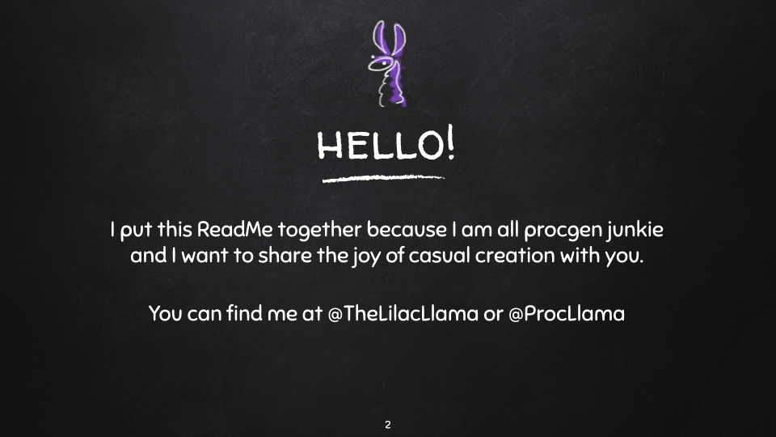

<p align="center">
  <a href="https://docs.google.com/presentation/d/1Xqr80vjGfUMMsPL2fWP68h_Iw53mcZ8f2wHcPIFz-J4">Click Here for the Slides</a>
</p>

# Interesting Procedural Generation resources...
>In computing, procedural generation is a method of creating data algorithmically as opposed to manually, typically through a combination of human-generated assets and algorithms coupled with computer-generated randomness and processing power.
> - [Wikipedia : Procedural Generation](https://en.wikipedia.org/wiki/Procedural_generation)


## What IS Proc Gen?
### In Simple Terms, ProcGen -> Procedural Generation
A Process for **Creation** of Content
- Uses **curated rules** or building blocks
- Plus usually a Sprinkle of **Randomization**
- An **an Engine** to make sense of it all.
  
.. it's usually code that uses small bits of content legos, put together in random ways to create *dynamic* content that can cover a wide range of possibilities in place of *static* content.

### Some of my Favorite Things that Use ProcGen
| Thing  | Details |
| ------------- | ------------- |
| [Dwarf Fortress](http://www.bay12games.com/dwarves/) | The deepest, most intricate simulation of a world that's ever been created.  |
| [Art Toy](https://www.gdcvault.com/play/1024213/Practical-Procedural-Generation-for) | A beautiful animated flower generator, that relies on an array of ints as 'genes'. |
| [Cave of Qud](http://www.cavesofqud.com/) | Is a science fantasy RPG & roguelike epic. It's set in a far future that's deeply simulated, richly cultured, and rife with sentient plants. |
| [Spore](https://www.spore.com/) | Spore is a 2008 life simulation real-time strategy God game developed by Maxis, published by Electronic Arts and designed by Will Wright. |
| [Nested](http://orteil.dashnet.org/nested) | A universe simulator. |

### But Proc Gen is not **JUST** for games.
> If you can define it. You can generate it.
- [Procedurally Generated Beethoven](https://www.youtube.com/watch?v=esRdmKYucIw&feature=youtu.be)
- [SkyKnit - Procedurally Generated Knitting](https://aiweirdness.com/post/173096796277/skyknit-when-knitters-teamed-up-with-a-neural)
- [Procedural Generated Terrain](http://www.mit.edu/~jessicav/6.S198/Blog_Post/ProceduralGeneration.html)

.... the problem is in the _defining_.

### The Two Biggest Issues - SCOPE and OATMEAL!

**SCOPE - The Problem**
> You've decided to SIMULATE THE WORLD!
```
Everything's so big!
And all the details so intricate.
And there's SO many edge cases!
I could be defining things FOREVER
```
**SCOPE - The Solution**
```
START SMALL!
Small parts.
Small pieces.
Small timeline!
```

**[OATMEAL](https://galaxykate0.tumblr.com/post/139774965871/so-you-want-to-build-a-generator) - The Problem**
> You've got everything down to the smallest oat able to be generated in infinite detail!
```
There's lots of detail!
And SO much variation!
... but very little observable difference.
... and thus ultimately little impact.
```
**OATMEAL - The Solution**
```
FAIL FAST!
Try it.
Tweak it.
Expand it!
```

>  ... basically this should sound a lot like writing most software. Find your MVP and iterate iterate iterate!

## [Tracery](http://tracery.io/)
> One of my Favorite Proc Gen Tools; 
### The Basics
> An author-focused, curated, simple text generation tool by [Kate Compton](https://twitter.com/galaxykate)
- [Originally Written in Javascript](https://github.com/galaxykate/tracery) (but 'ported to many others!)
- Requires a JSON structured Grammar
- Expands rules to generate text...
- ... but remember, html is ultimately just a special text!
### What does it mean to make an ‘author-focused’ generative text tool? 
> We consider the potential authors for such a generative tool to be creative persons who
are interested in the expressivity of language and the aesthetics of prose. They
may not self-identify as ‘programmers’ or want to write code, but they want
to create generative text that is algorithmically combinatorial and surprising,
while still seeing their authorial ‘voice’ in the finished text.
> - [Tracery : An Author Focused Generative Text Tool](http://www.galaxykate.com/pdfs/ComptonKybartasMateas15-Tracery%20An%20Author-Focused%20Generative%20Text%20Tool.pdf)

### Grammar
#### Written in JSON
> Tracery's backbone is built on the concept of grammars; written in JSON, a grammar is key value pairs. The key is the name of a rule, where the value is an array of options to choose from.
```
{
  “color”:[“blue”,”red”,“purple”]
}
```
>Here we've described a rule **color** with three potential expansions: blue, red or purple.

#### Rule Expansions
> Once defined, a rule can be triggered for expansion. Internally this triggering is done by using the rule name in a separate rule but surrounded by # symbols. (Ex: #color#). This expansion means that every rule triggered will be flattened - changing it from a potential choice across multiple options to one singluar option. (Ex: The expansion of #color# could turn into purple.)

> Generally, the distribution of probability is even across the options within a rule, but you can reweight them by repeating options. (Ex: Changing color to choose from blue, blue, red, purple would result in blue being chose twice as often as the other colors.)

> Also, the 'root' of your grammar is generally expected to be named 'origin'.
```javascript
{
  “color”:[“blue”,”red”,“purple”],
  “origin”:[
    “I like #color# cake.”,
    “I like #color# hats.”
  ]
}
```
> Here we have our original color rule, but now have our root story node origin that also utilizes that color rule.
##### Flattening #origin#
> If we were to flatten #origin#...
1. **#origin#** is our first expansion.
1. **#origin#** then could be resolved as "I like #color# cake."
1. This includes the rule expansion, **#color#**.
1. **#color#** could then resolve into "purple".
1. **#origin#** becomes "I like purple cake."

> From this base understanding you can create much more complicated choice trees by nesting or combining rules.
``` javascript
{
  “color”:[“blue”,”red”,“purple”],
  “origin”:[
      “I #opinion# #obj#.”
  ],
  “feel”:[“dislike”,”like”],
  “obj”:[“#color# #thing#”],
  “thing”:[“hats”,”cake”,”birds”]
}
```

#### Modifiers
> Tracery has also been built to include a bunch of language specific modifiers, as creating understandable english prose can be hard if truly including a loosely coupled variance.
> Examples include things like capitilization, pluralization, addition of an indefinite article etc.
``` javascript
{
  “color”:[“blue”,”red”,“purple”],
  “origin”:[
      “#color.capitalize# #thing.s# are lovely.”
  ],
  “thing”:[“hat”,”cake”,”bird”]
}
```
> #origin# here could become: "Blue birds are lovely" after the modifier applications, even though color's options are all lowercase, and all thing options are singular.

#### Conditional Rules
> Sometimes though, you want to use a bit of saved state - usually for keeping track of a particular choice for reuse. (#color# expansion chooses a _new_ color every time it's used!). You can instead, however, expand a rule into a new rule definition by using this definition syntax: **[ruleName:#expansion#]**

``` javascript
{
  “color”:[“blue”,”red”,“purple”],
  “origin”:[
      “[chosenColor:#color#]I like #chosenColor# birds, but not #chosenColor# bananas.”
  ]
}
```
> #origin# here could become: "I like red birds, but not red bananas." because a color is expanded and stored into chosenColor before the rest of the rule evaluates.

> **Expansions work from left to right, so make sure to add rule definitions that the rest of your text might require to the beginning of your text expansions, rather than at the end.**

### Other Useful Resources
> Here are some other useful resources to read up on (and try your hand at building) tracery & grammars.
- **Editors & Sandboxes**
   - [Official Tracery Editor](http://tracery.io/editor/)
   - [Crystal Code Palace Tutorial](http://www.crystalcodepalace.com/traceryTut.html)
   - [Tracery Writer](https://beaugunderson.com/tracery-writer/#?grammar=%7B%0A++%22origin%22%3A+%5B%0A++++%22%23color.capitalize%23+%23animal.s%23+are+%23often%23+%23mood%23.%22%2C%0A++++%22%23animal.a.capitalize%23+is+%23often%23+%23mood%23%2C+unless+it+is+%23color.a%23+one.%22%0A++%5D%2C%0A++%22often%22%3A+%5B%0A++++%22rarely%22%2C%0A++++%22never%22%2C%0A++++%22often%22%2C%0A++++%22almost+always%22%2C%0A++++%22always%22%2C%0A++++%22sometimes%22%0A++%5D%2C%0A++%22color%22%3A+%5B%0A++++%22blue%22%2C%0A++++%22green%22%2C%0A++++%22grey%22%2C%0A++++%22indigo%22%2C%0A++++%22orange%22%2C%0A++++%22purple%22%2C%0A++++%22turquoise%22%0A++%5D%2C%0A++%22animal%22%3A+%5B%0A++++%22unicorn%22%2C%0A++++%22raven%22%2C%0A++++%22sparrow%22%2C%0A++++%22scorpion%22%2C%0A++++%22coyote%22%2C%0A++++%22eagle%22%2C%0A++++%22owl%22%2C%0A++++%22lizard%22%2C%0A++++%22zebra%22%2C%0A++++%22duck%22%2C%0A++++%22kitten%22%0A++%5D%2C%0A++%22mood%22%3A+%5B%0A++++%22vexed%22%2C%0A++++%22indignant%22%2C%0A++++%22impassioned%22%2C%0A++++%22wistful%22%2C%0A++++%22astute%22%2C%0A++++%22courteous%22%0A++%5D%2C%0A++%22natureNoun%22%3A+%5B%0A++++%22ocean%22%2C%0A++++%22mountain%22%2C%0A++++%22forest%22%2C%0A++++%22cloud%22%2C%0A++++%22river%22%2C%0A++++%22tree%22%2C%0A++++%22sky%22%2C%0A++++%22earth%22%2C%0A++++%22void%22%2C%0A++++%22desert%22%0A++%5D%0A%7D)
- **Tutorials & Reading**
   - [Tracery tutorial](http://air.decontextualize.com/tracery/) by Alison Parrish
   - [Sculpting Generative Text with Tracery](https://www.andrewzigler.com/blog/sculpting-generative-text-with-tracery/) by Andrew Zigler
   - [Learning Tracery: Part 1: Example and Definitions](https://videlais.com/2018/10/04/learning-tracery-part-1-example-and-definitions/) by Dan Cox
   - [Learning Tracery: Part 2: Grammars](https://videlais.com/2018/10/05/learning-tracery-part-2-grammars-and-more-grammars/) by Dan Cox
   
